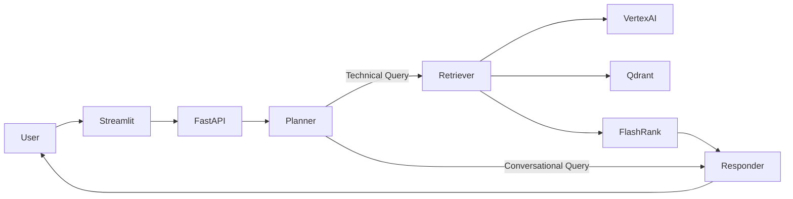
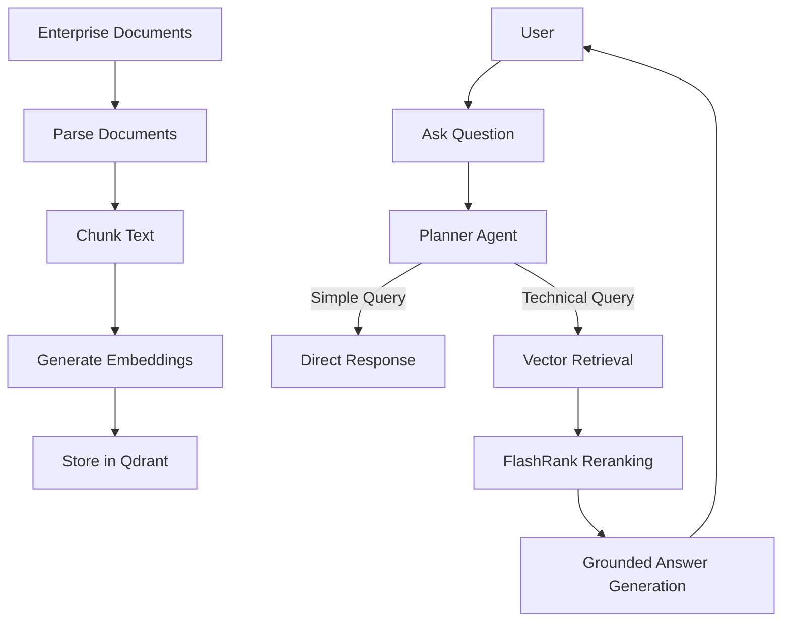
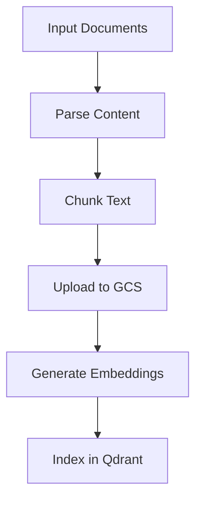
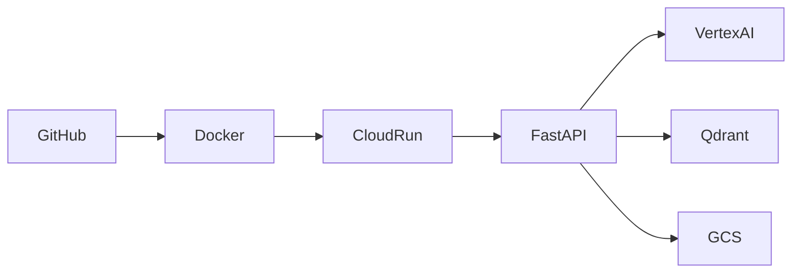

# 🚀 Enterprise Agentic RAG System

> **Production-ready Agentic Retrieval-Augmented Generation (RAG) platform** built with **LangGraph, FastAPI, Qdrant, Google Cloud, and modern LLMs** for intelligent enterprise knowledge retrieval and question answering over large-scale enterprise documentation.


---

## 🎯 Overview

Enterprise documentation is often spread across PDFs, HTML pages, Office documents, internal wikis, and knowledge repositories. Traditional search systems struggle to provide accurate, context-aware answers.

This project introduces an **Agentic RAG Architecture** that intelligently determines whether a query should:

- 💬 Be answered directly using conversational context
- 📚 Retrieve relevant enterprise documents
- 🧠 Reason over retrieved knowledge before generating a response

The result is a scalable AI assistant capable of delivering grounded, explainable, and context-rich answers over large document repositories.

---

## ✨ Key Features

| Feature | Description |
|----------|-------------|
| 🤖 Agentic Workflow | LangGraph-based Planner → Retriever → Responder architecture |
| 📄 Multi-format Ingestion | Supports PDF, HTML, TXT, DOCX and Office documents |
| 🔍 Semantic Search | Vector retrieval using Qdrant |
| 🎯 Semantic Reranking | FlashRank-powered context optimization |
| ☁️ Cloud Ready | Google Cloud Storage & Cloud Run integration |
| 📊 Observability | LangSmith + Logfire tracing and monitoring |
| ⚡ REST APIs | FastAPI backend services |
| 💻 Interactive UI | Streamlit-based chatbot interface |

---

## 🏗️ System Architecture



---

## 🔄 End-to-End Workflow



---

## 🧠 Runtime Query Flow

```text
User Question
      │
      ▼
Planner Agent
      │
      ├───────────────┐
      ▼               ▼
Conversation     Retrieval
                     │
                     ▼
          Qdrant Vector Search
                     │
                     ▼
              FlashRank
                     │
                     ▼
          Grounded LLM Response
                     │
                     ▼
                Final Answer
```

---

## 📂 Repository Structure

```text
Enterprise_RAG/
│
├── app/
│   ├── agents/          # LangGraph workflows
│   ├── ingestion/       # Parsing, chunking, indexing
│   ├── services/        # Retrieval, reranking, embeddings
│   ├── gateway/         # LLM routing and model gateway
│   └── main.py          # FastAPI entry point
│
├── ui/
│   └── app.py           # Streamlit frontend
│
├── DATA/                # Source documents
├── DOCS/                # Architecture documentation
├── Dockerfile
├── commands.md
└── README.md
```

---

## ⚙️ Tech Stack

### Backend & Orchestration
- Python
- FastAPI
- LangGraph
- LangChain
- Portkey Gateway

### Retrieval & AI
- Qdrant
- Google Vertex AI Embeddings
- FlashRank
- Groq LLMs

### Data Processing
- Google Cloud Storage
- Google Document AI
- PDF / HTML / TXT Parsers

### UI & Monitoring
- Streamlit
- LangSmith
- Logfire

---

## 📥 Document Ingestion Pipeline

The ingestion pipeline transforms enterprise content into searchable knowledge.

### Process

1. Discover source files
2. Parse supported document formats
3. Chunk extracted content
4. Upload processed artifacts to Google Cloud Storage
5. Generate embeddings using Vertex AI
6. Store vectors in Qdrant



---

## 🚀 Local Setup

### Prerequisites

- Python 3.10+
- Google Cloud Project
- Vertex AI Enabled
- Qdrant Instance
- Groq API Key
- Portkey API Key

### Clone Repository

```bash
git clone https://github.com/your-username/Enterprise_RAG.git

cd Enterprise_RAG
```

### Create Virtual Environment

```bash
python -m venv .venv

source .venv/bin/activate

# Windows
.venv\Scripts\activate
```

### Install Dependencies

```bash
pip install -r requirements.txt
```

---

## 🔐 Environment Variables

Create a `.env` file in the project root.

```env
PROJECT_ID=
LOCATION=

QDRANT_URL=
QDRANT_API_KEY=

PORTKEY_API_KEY=
GROQ_API_KEY=

LANGSMITH_API_KEY=
LOGFIRE_TOKEN=

GOOGLE_APPLICATION_CREDENTIALS=
```

---

## ▶️ Run the Backend

```bash
uvicorn app.main:app --reload --port 8000
```

Backend URL:

```text
http://localhost:8000
```

---

## 💻 Run the Streamlit UI

```bash
streamlit run ui/app.py
```

---

## 📚 Run Data Ingestion

```bash
python -m app.ingestion.processor DATA --wipe
```

---

## 📊 Observability

The application includes production-style monitoring and tracing.

### LangSmith

- Agent execution tracing
- Prompt debugging
- Workflow visualization

### Logfire

- API request monitoring
- Error tracking
- Backend diagnostics

### Benefits

- End-to-end visibility
- Faster troubleshooting
- Performance monitoring
- Retrieval quality analysis

---

## ☁️ Deployment Architecture



### Deployment Components

- Docker Container
- Google Cloud Run
- Google Cloud Storage
- Qdrant Vector Database
- Vertex AI Embeddings
- LangSmith Monitoring
- Logfire Tracing

---

## 🌟 Project Highlights

- Built an Agentic RAG pipeline using LangGraph
- Implemented Planner → Retriever → Responder architecture
- Integrated semantic retrieval with Qdrant
- Added FlashRank reranking for improved context relevance
- Connected ingestion and storage workflows to Google Cloud
- Enabled observability using LangSmith and Logfire
- Designed for scalable enterprise knowledge retrieval use cases
- Containerized for cloud deployment

---

## 🛣️ Future Roadmap

- [ ] Persistent conversation memory
- [ ] Multi-agent collaboration
- [ ] Human-in-the-loop approval workflows
- [ ] Hybrid Search (BM25 + Vector Search)
- [ ] Retrieval Evaluation Framework
- [ ] User Feedback Loops
- [ ] Authentication & RBAC
- [ ] Safety Guardrails

---

## 📄 License

This project is licensed under the **MIT License**.

---

## ⭐ Summary

Enterprise Agentic RAG is a production-oriented AI platform that combines:

- Agentic workflows with LangGraph
- Semantic retrieval with Qdrant
- Reranking using FlashRank
- Vertex AI embeddings
- FastAPI backend services
- Google Cloud deployment
- End-to-end observability

The project serves as a foundation for building scalable enterprise AI assistants capable of answering questions grounded in real organizational knowledge.
